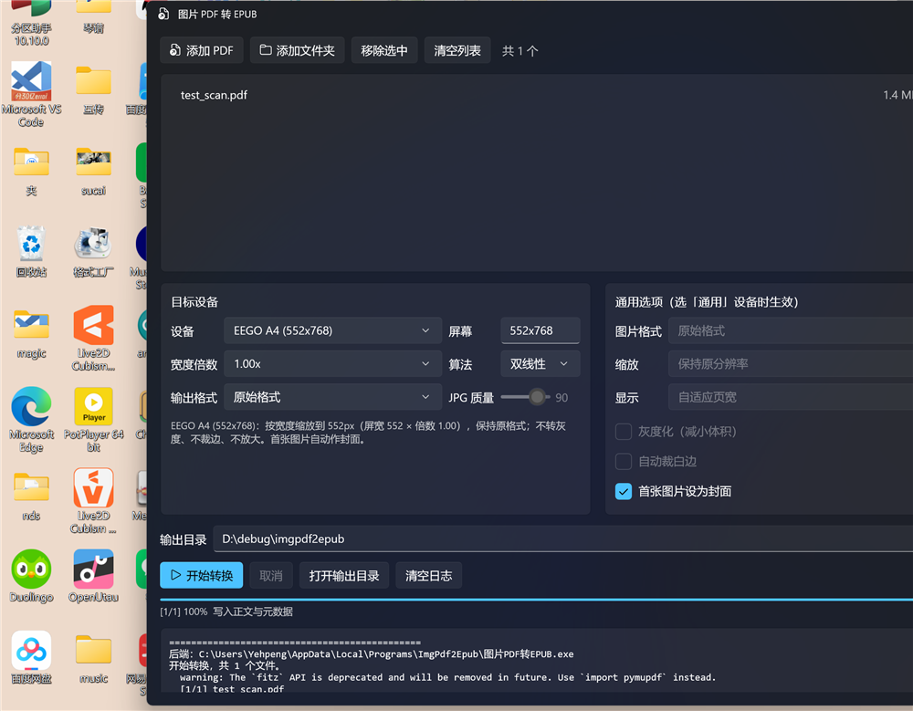

# 图片 PDF 转 EPUB

[English](#english) | 中文

把**纯图片（扫描版）PDF** 转成 EPUB 电子书。不做 OCR、不识别文字，直接把每一页的图像抽出来封装成标准 EPUB 3。

原生 **WinUI 3** 界面（C# + XAML，Mica 毛玻璃），可选装包即用，无需任何运行环境。



---

## 特性

- **原生 WinUI 3 界面** —— 不是网页套壳。Mica 背景、自绘标题栏、跟随系统深浅色
- **拖拽导入** —— 直接拖 PDF 或文件夹进来
- **单章节输出** —— 所有页面放在同一个 XHTML 里，避免阅读器频繁加载新章节导致卡顿
- **小屏设备预设** —— 内置 EEGO A4、Pico，也可自定义屏幕尺寸
- **只缩不放** —— 图片小于目标宽度时原样透传，连重编码都不做
- **基线 JPEG** —— JPG 输出固定 SOF0，规避部分阅读器不支持渐进式 JPEG 的问题
- **自动封面** —— 第一页设为封面（EPUB3 `cover-image` + 旧版 `meta`/`guide` 双声明）
- **不联网** —— 全程本地处理

## 下载安装

到 [Releases](../../releases) 下载 `图片PDF转EPUB-安装程序.exe`：

- **不需要管理员权限**
- **不需要证书**
- **不需要装 .NET 或 Python**

双击即可，装完自动启动。会创建桌面和开始菜单快捷方式，可在「设置 → 应用」中卸载。

## 使用

1. 拖入 PDF，或点「添加 PDF」
2. 选目标设备
3. 点「开始转换」

### 设备预设

| 设备 | 屏幕（宽×高） |
| --- | --- |
| 通用（不缩放） | 保持原尺寸 |
| EEGO A4 | 552 × 768 |
| Pico | 684 × 1216 |
| 自定义 | 自己填，如 800×1200 |

预设行为：**只按宽度缩放**，不转灰度、不裁边、不放大。输出宽 = `屏幕宽 × 宽度倍数`。

### 输出格式

| 选项 | 说明 |
| --- | --- |
| 原始格式 | 保持原图格式不动（默认） |
| 统一 JPG | 全部转基线 JPEG（SOF0），可调质量 |
| 统一 PNG | 全部转 PNG，无损但体积约为 JPEG 的 2.2 倍 |

### 缩放算法

默认**双线性（bilinear）**，比 Lanczos 更柔和，文字边缘不易产生振铃。可切换为 Lanczos。

## 命令行

安装后 `%LOCALAPPDATA%\Programs\ImgPdf2Epub\图片PDF转EPUB.exe` 同时支持命令行：

```bat
图片PDF转EPUB.exe book.pdf                          :: 默认转换
图片PDF转EPUB.exe book.pdf --eego                   :: EEGO A4，552px
图片PDF转EPUB.exe book.pdf --pico                   :: Pico，684px
图片PDF转EPUB.exe book.pdf --device-mode --screen 800x1200   :: 自定义屏幕
图片PDF转EPUB.exe book.pdf --eego --format jpg      :: 转 JPEG
图片PDF转EPUB.exe book.pdf --eego --headroom 1.25   :: 留 25% 余量
图片PDF转EPUB.exe book.pdf --eego --resample lanczos :: 换缩放算法
图片PDF转EPUB.exe C:\扫描书 --recursive --eego      :: 批量
```

主要参数：

| 参数 | 说明 |
| --- | --- |
| `-o, --outdir` | 输出目录，默认与源文件同目录 |
| `-r, --recursive` | 递归扫描子目录 |
| `--eego` / `--pico` | 设备预设 |
| `--device-mode` | 用设备模式（配合 `--screen` 即自定义） |
| `--screen WxH` | 屏幕尺寸 |
| `--headroom N` | 宽度倍数，默认 1.0 |
| `--format` | `auto` / `jpg` / `png` |
| `--resample` | `bilinear`（默认）/ `lanczos` |
| `--gray` / `--trim` | 转灰度 / 裁白边（默认都不做） |
| `--no-cover` | 不生成封面 |
| `--json-progress` | 进度以 JSON 逐行输出（供 GUI 调用） |

## 从源码构建

### 环境

- Python 3.9+
- .NET SDK 8.0
- Windows 10 1903+ / Windows 11

### Python 转换引擎

```bat
python -m venv .venv
.venv\Scripts\pip install PyMuPDF Pillow pyinstaller tkinterdnd2
.venv\Scripts\python app.py          :: 无参数=tkinter GUI，带参数=命令行
```

打包成单文件 exe：

```bat
.venv\Scripts\python -m PyInstaller --noconfirm --clean build.spec
```

### WinUI 3 界面

```bat
cd WinUI
dotnet publish -c Release -r win-x64 --self-contained true ^
  -p:WindowsAppSDKSelfContained=true -o publish
```

### 生成安装程序

把 WinUI 的 `publish\` 和 Python 的 `dist\图片PDF转EPUB.exe` 合并成载荷，
再配合 `packaging\` 里的脚本用 IExpress 打成单文件自解压 exe。

### 校验输出

```bat
.venv\Scripts\python verify_epub.py out\book.epub
```

逐项检查 mimetype、manifest、spine、图片引用、目录锚点、封面、JPEG SOF 等共 20 项。

## 项目结构

```
converter.py         核心转换引擎（PDF 抽图 + EPUB 打包）
cli.py               命令行接口
gui.py               tkinter 备用界面
app.py               统一入口
build.spec           PyInstaller 配置
verify_epub.py       EPUB 规范校验（20 项）
make_test_pdf.py     生成测试用纯图片 PDF
WinUI/               WinUI 3 界面（C# + XAML）
icon/                图标生成脚本与 Fluent 图标源文件
packaging/           安装程序脚本（install.ps1 / IExpress 配置）
```

## 技术说明

- **抽图策略**：优先直接从 PDF 抽取嵌入的原始图片（无损且快）；一页里有多张图或为矢量内容时，回退为按估算 DPI 整页渲染。
- **单章节结构**：正文 `spine` 只有 1 项，所有页面在同一个 XHTML 中，用 `page-break-after` 分页。目录指向文档内 `#page-N` 锚点，跳页不触发加载新章节。
- **显式像素宽高**：每张图写 `style="width:Npx;height:Mpx"` 而非 CSS `width:100%`，避免阅读器为铺满宽度而重采样。

## 许可证

**GNU Affero General Public License v3.0 (AGPL-3.0)** —— 见 [LICENSE](LICENSE)。

> **为什么是 AGPL 而不是 MIT？**
>
> 本项目使用 [PyMuPDF](https://github.com/pymupdf/PyMuPDF) 解析 PDF，而 PyMuPDF 采用
> **AGPL-3.0 / 商业授权 双许可**。AGPL 具有传染性，因此整个项目必须以 AGPL-3.0 发布。
>
> 若你需要闭源或商业使用，可以：
> 1. 向 Artifex 购买 PyMuPDF 商业授权，或
> 2. 把 PDF 解析层替换为宽松协议的库（如 [pypdfium2](https://github.com/pypdfium2-team/pypdfium2)，Apache-2.0）

如果你基于本项目修改并**通过网络提供服务**，AGPL 要求你向用户提供修改后的源码。

## 致谢

- 图标：[Fluent UI System Icons](https://github.com/microsoft/fluentui-system-icons) 的 `book_arrow_clockwise_24_filled`（MIT）
- 界面框架：[Windows App SDK](https://github.com/microsoft/WindowsAppSDK) / WinUI 3（MIT）
- PDF 解析：[PyMuPDF](https://github.com/pymupdf/PyMuPDF)（AGPL-3.0 / 商业）
- 图像处理：[Pillow](https://github.com/python-pillow/Pillow)（MIT-CMU）
- 拖放支持：[tkinterdnd2](https://github.com/pmgagne/tkinterdnd2)（MIT）

---

## English

A tool that converts **image-only (scanned) PDFs** into EPUB e-books — no OCR, it simply
extracts each page image and packages it into a standard EPUB 3.

Features a native **WinUI 3** interface (C# + XAML, Mica backdrop) with a bundled
Python conversion engine. The installer requires no admin rights, no certificate,
and no runtime prerequisites.

Highlights: drag & drop, single-chapter output (avoids reader stalls on many small
chapters), device presets (EEGO A4 / Pico / custom), shrink-only scaling, baseline
JPEG (SOF0) output, and automatic cover generation.

Licensed under **AGPL-3.0** because it depends on PyMuPDF (AGPL-3.0 / commercial dual license).
